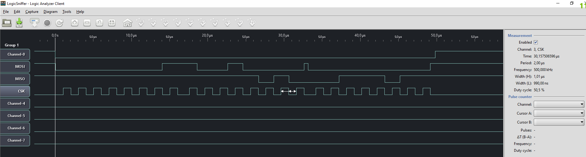

# MCP3008 Driver example (SPI)

This example shows how to to read analog values from a MCP3008 ADC chip.

## Wiring

- SCK
- MISO
- MOSI
- PB0 (CS)

## Expected output

```
ADC value: 0,   voltage: 0.000 V (0.00 %)
ADC value: 186, voltage: 0.887 V (18.18 %)
ADC value: 418, voltage: 1.994 V (40.86 %)
ADC value: 506, voltage: 2.414 V (49.46 %)
ADC value: 506, voltage: 2.414 V (49.46 %)
ADC value: 504, voltage: 2.405 V (49.27 %)
ADC value: 504, voltage: 2.405 V (49.27 %)
ADC value: 558, voltage: 2.662 V (54.55 %)
ADC value: 788, voltage: 3.760 V (77.03 %)
ADC value: 929, voltage: 4.433 V (90.81 %)
```

## Measures

