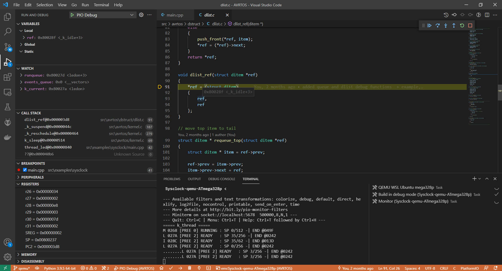
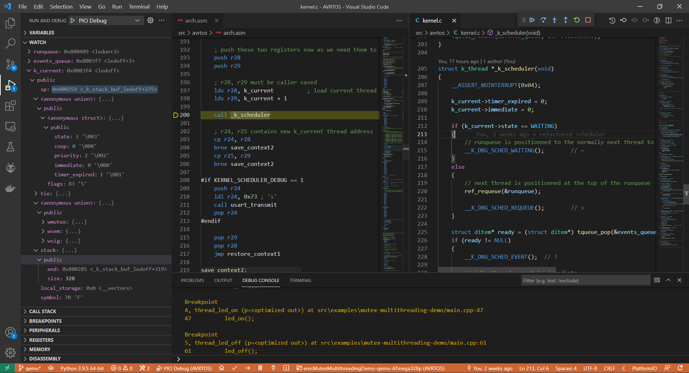

# AVRTOS : RTOS attempt for 8bits AVR microcontrollers

## Introduction

This project is an attempt to create a real time operating system (RTOS) for AVR 8 bits microcontrollers.

Following avr architectures are supported/tested :
- avr5, especially ATmega328p : tested with an Arduino PRO
- avr6, especially ATmega2560 : tested with an Arduino Mega2560

Following features are supported:
- Cooperative threads
- Preemptive threads with time slice between 1 ms and 16 ms (timer 0 and timer 2) up to 4 seconds (timer 1)
- Configurable sysclock timer among hardware timers : timer0 (8bits), timer1 (16 bits), timer2 (8 bits)
- Mutex and Semaphores
- Thread sleep up to 65 seconds (or more if using high precision time objects)
- Scheduler lock/unlock to temporarily set a preemptive thread as cooperative
- Waking up threads waiting on events (mutex unlock, semaphore give)
- Scheduler calls (thread switching) from interrupt handler
- Canaries
- Runtime stack/thread creation
- avr5 and avr6 architectures
- Workqueues and system workqueue 
- Fifo
- Memory slabs

Minor features:
- thread naming with a symbol, e.g. 'M' for the main thread 'I' for the idle thread 
- thread context passing
- debug/utils functions : RAM_DUMP, CORE_DUMP, read_ra (read return address)
- data structures : dlist (doubly linked list), queue (singly linked list), time queue (singly linked list with delay parameter)
- I/O : leds, uart
- Kernel Assertions (__ASSERT)
- Custom errors code: e.g. : EAGAIN, EINVAL, ETIMEOUT

What paradigms/concepts are not supported:
- Nested interrupts
- Dedicated stack for interrupt handlers
- Thread local storage (removed)

What features will be implemented :
- System time
- Statistics CPU use per thread
- Signals
- Delayed start, suspending/resuming threads
- Stack sentinels
- Pseudo random number generator : [LFSR](https://es.wikipedia.org/wiki/LFSR)
- Memslabs
- Task scheduling
- Kernel fault

What enhancements are planned :
- Add `swap_data` address in thread in order to pass data when an expected object is available, e.g. on `mutex_unlock`.
  - This prevent to release and lock the mutex again, the mutex owner is just passed to the first pending thread.
  - The same with other objects : semaphores, fifo, slabs
- Using makefile to build the project for a target
- Propose this project as a library
- Fix when submitting the same work two time, while it has not yet been executed -> use double linked lists for (tqueue)
- Wrong : Using double linked lists would also help to remove the idle thread from the runqueue in one function call, without finding it
- Check that the thread own the mutex/semaphore when releasing it
- Cancel submitted item
- Make the library fully C compliant.
- Allow thread safe termination
- Measure the execution time for thread switch and all kernel functions calls (k_mutex_lock, k_work_schedule, ...)
- Don't allow mutex unlock from interrupt, then change cli to k_shed_lock when handling mutex lock/unlock

What enhancements/features are not planned :
- Prioritization
- Totally removing CPU idle thread
- Stack for interrupts handlers
- Delay the submission of a work in a workqueue
- Saving thread errno

## Getting started example :

### Description

In this example, we spawn three threads (+ main thread + idle thread) :
- Two preemptive threads : one set the led ON for 100ms and the other to OFF for the same duration
    - A mutex is protecting the LED access, and both threads keeps the mutex locked while waiting for 100ms.
    - both threads use the same reentrant function
- One cooperative threads blocks the execution of all threads for 500ms every 2 seconds.
- The main thread releases the CPU forever when initialization finished

On an Arduino Pro (or Arduino Pro Mini), based on an ATmega328p (avr5) the led should be blinking at the frequency of 5Hz and then block for 500ms every 2 seconds.

Configuration option : `CONFIG_KERNEL_TIME_SLICE=10`

### Code

```cpp
#include <avr/io.h>
#include <util/delay.h>
#include <avrtos/misc/uart.h>
#include <avrtos/misc/led.h>
#include <avrtos/kernel.h>
#include <avrtos/debug.h>

void thread_led(void *context);
void thread_coop(void *context);

uint8_t on = 1u;
uint8_t off = 0u;

K_MUTEX_DEFINE(mymutex);  // mutex protecting LED access
K_THREAD_DEFINE(ledon, thread_led, 0x50, K_PRIO_PREEMPT(K_PRIO_HIGH), (void *)&on, 'O');
K_THREAD_DEFINE(ledoff, thread_led, 0x50, K_PRIO_PREEMPT(K_PRIO_HIGH), (void *)&off, 'F');
K_THREAD_DEFINE(coop, thread_coop, 0x100, K_PRIO_COOP(K_PRIO_HIGH), nullptr, 'C');

int main(void)
{
  led_init();
  usart_init();
  k_thread_dump_all();
  sei();
  k_sleep(K_FOREVER);
}

void thread_led(void *context)
{
  const uint8_t thread_led_state = *(uint8_t*)context;
  while(1)
  {
    k_mutex_lock(&mymutex, K_FOREVER);
    led_set(thread_led_state);
    usart_transmit(thread_led_state ? 'o' : 'f');
    k_sleep(K_MSEC(100));
    k_mutex_unlock(&mymutex);
  }
}

void thread_coop(void*)
{
  while(1)
  {
    k_sleep(K_MSEC(2000));
    usart_transmit('_');
    _delay_ms(500); // blocking all threads for 500ms
  }
}
```

### Logs

```
===== k_thread =====
M 031C [PREE 0] RUNNING : SP 0/512 -| END @056E
C 032C [COOP 1] READY   : SP 35/256 -| END @0207
F 033C [PREE 1] READY   : SP 35/80 -| END @0257
O 034C [PREE 1] READY   : SP 35/80 -| END @02A7
K 035C [PREE 3] READY   : SP 35/62 -| END @02E6
fofofofofofofofofofo_fofofofofofofofofofo_fofofofofofofofofofo_fofof
```

## Note

### Peripherals

- This library only needs one timer among following hardware timers :
  - timer0 : allow KERNEL_TIME_SLICE between 1 and 16 milliseconds
  - timer1 : allow KERNEL_TIME_SLICE between 1 and 16 milliseconds and 20ms, 25ms, 50ms, 100ms, 200ms, 250ms, 500ms, 1s, 2s, 2500ms, 3s, 4s
  - timer2 : allow KERNEL_TIME_SLICE between 1 and 16 milliseconds

The hardware timer used can be configured with CONFIG_KERNEL_SYSLOCK_HW_TIMER configuration option.

- If configuration option KERNEL_DEBUG_PREEMPT_UART is enabled, the usart0 peripheral is used (+ RX interrupt vector)

### qemu

As [qemu](https://github.com/qemu/qemu) support [avr architecture](https://github.com/qemu/qemu/tree/master/target/avr), any program built using this RTOS can be emulated in qemu and debugged using GDB.

### Overhead
- In term of flash, the overhead is approximately 3KB
- In term of RAM :
  - kernel objects
    - runqueue : 2B
    - events queue : 2B
    - thread idle stack is at least 34/36 byte + 18B thread structure (should be removed in the future)
  - a thread structure is 16B + stack size which is at least 35/36byte
  - a mutex is 5B
  - a semaphore is 5B
  - a workqueue is 5B
    - a k_work item is 6B
  - a fifo is 6B
  - a memory slab is 11B
- In term of time, thread switch is between 26µs and 30µs on an 16MHz AVR (will be measured more precisely)
- Plan additionnal stack for every thread that have their interrupt flag set, whose the stack could be used during interrupt handlers calls.
  
### Zephyr RTOS

Inspiration in the naming comes greatly from the project [Zephyr RTOS](https://github.com/zephyrproject-rtos/zephyr), 
as well as some paradigms and concepts regarding multithreading : [Zephyr : Threads](https://docs.zephyrproject.org/latest/reference/kernel/threads/index.html).
However be carefull, many behavior are different from the ones from Zephyr RTOS ! For example, regarding mutexes, AVRTOS kernel doesn't check if the thread releasing a mutex actually owns it, moreover it's possible to unlock a mutex from an interrupt routine routine while this is not the case in Zephyr.

From Zephyr RTOS documentation `k_mutex_unlock` : 

```
Mutexes may not be unlocked in ISRs, as mutexes must only be manipulated
in thread context due to ownership and priority inheritance semantics.
```

### Features

Some paradigms appear in the code but are actually not implemented for now, e.g. prioritization

### Arduino

This library should be compatible with the Arduino framework but was not tested on it:
- As the `millis()` function from arduino uses timer0 you need to configure the kernel sysclock to use another hardware timer among timer1 (16 bits) and timer2 (8 bits). This should be the only limitation.

- https://github.com/arduino/ArduinoCore-avr/blob/master/cores/arduino/wiring.c#L65-L77

### Git

Git history of the project has been reworked in order to remove big files (as screenshots or disassembly files). Some links can be invalid when working on an old commit.

## PlatformIO

- This project was developed using PlatformIO environnement in Visual Studio Code IDE.
- Each example can be easily built using the *pio* configuration file :
    - Board, e.g. : pro16MHzatmega328, megaatmega2560
    - Choose the linker script depending on the AVR architecture
    - Choose *upload* and *monitor* ports

```ini
[env]
platform = atmelavr
board = pro16MHzatmega328
; board = megaatmega2560

src_filter =
    +<avrtos/>

build_flags = 
    -Wl,-T./avrtos-avr5.xn
    ; -Wl,-T./avrtos-avr6.xn

upload_port = COM3

monitor_port = COM3
monitor_speed = 500000
```

## Configuration options
| Configuration option | Description |
| --- | --- |
| THREAD_MAX                    | Define the maximum number of threads supported |
| THREAD_MAIN_THREAD_PRIORITY   | Define the main thread type (coop/prempt) and priority |
| THREAD_EXPLICIT_MAIN_STACK    | Tells if the main stack location and size must be defined at compilation time (1), or if the default main stack behaviour (stack at RAMEND) should be kept (0).
| THREAD_MAIN_STACK_SIZE | In the case we defined (EXPLICIT_MAIN_STACK == 1), this configuration option defines the size of the main stack |
| THREAD_USE_INIT_STACK_ASM | Tells if we should use the C or the Assembler function to define our threads at runtime |
| KERNEL_HIGH_RANGE_TIME_OBJECT_U32 | Configure to use uint32_t as k_delta_ms_t ~= 50 days or keep (uint16_t) ~= 65seconds |
| THREAD_DEFAULT_SREG | Default SREG value for other thread on stack creation. Main thread default SREG is always 0 |
| KERNEL_DEBUG | Enable Kernel Debug features |
| KERNEL_API_NOINLINE | Enable Kernel debug for function, that set some of them noinline |
| KERNEL_SCHEDULER_DEBUG | Enable Kernel Debug in scheduler |
| KERNEL_PREEMPTIVE_THREADS | Enable preemtive threads feature |
| KERNEL_TIME_SLICE | Time slice in milliseconds |
| KERNEL_SYSLOCK_HW_TIMER | Select Hardware timer among 8 bits timers : timer0 (0) and timer2 (2) and 16 bit timer : timer1 (1) |
| KERNEL_SYSCLOCK_AUTO_INIT | Auto start kernel sysclock |
| KERNEL_DEBUG_PREEMPT_UART | Use uart rx interrupt as preempt signal |
| KERNEL_THREAD_IDLE | KERNEL_DEBUG_PREEMPT_UART |
| KERNEL_THREAD_IDLE_ADD_STACK | Kernel thread idle addtionnal stack |
| KERNEL_ALLOW_INTERRUPT_YIELD |  Allow interrupt yield, this forces to add more stack to idle thread, since it is possible to save the current interrupt context while being in idle thread this happens often. |
| THREAD_CANARIES | Enable thread canaries |
| THREAD_CANARIES_SYMBOL | Define thread canaries symbol |
| SYSTEM_WORKQUEUE_ENABLE | Enable system workqueue |
| SYSTEM_WORKQUEUE_STACK_SIZE | Define system workqueue stack size |
| SYSTEM_WORKQUEUE_PRIORITY | Define system workqueue thread priority |
| KERNEL_ASSERT | Enable kernel assertion test for debug purpose |

## Known issues

- It's possible to preempt a cooperative thread from an interrupt when called k_yield, k_mutex_unlock, ... from it.
  - it's dangerous to use some kernel function that trigger a thread switch, as we cannot predict which will be the current thread when an interrupt occures.
  - Nothing is yet planned to prevent the developper from doing this.
- This library is not full c compliant, this enhancement is planned. For example, the macro defining a thread canot be compiled as a c file.
  - For now it is adviced to use threads macros from C++ files : e.g. `main.cpp` 

## Debugging

### Emulate with QEMU and debug

[qemu](https://www.qemu.org/) implements an emulator for AVR architectures.

My install :
- Environnement : Windows 10
- Ubuntu 20.04 (WSL)
- [qemu v6.1.0](https://github.com/qemu/qemu/tree/v6.1.0)

Steps : 
1. Building project in debug mode : 
  - `build_type = debug`
  - Make sure to use timer1 as syslock !
  
2. Emulate on qemu : Run command from WSL :
  `~/qemu/qemu/build/avr-softmmu/qemu-system-avr -M mega2560 -bios .pio/build/Sysclock-qemu-ATmega2560/firmware.elf -s -S -nographic -serial tcp::5678,server=on,wait=off`

3. Attach serial :
  - From WSL : `telnet localhost 5678`
  - From Visual Studio Code IDE : Serial Monitor : `Ctrl + Alt + S`

4. Attach debugger in VSC environnement :
  - `Ctrl + F5`

Note that only few peripherals are supported on avr architecture (https://qemu-project.gitlab.io/qemu/system/target-avr.html) :
  - `timer1` : 
    - https://github.com/qemu/qemu/blob/master/hw/timer/avr_timer16.c
    - https://github.com/qemu/qemu/blob/master/include/hw/timer/avr_timer16.h
  - `usart0` :
    - https://github.com/qemu/qemu/blob/master/hw/char/avr_usart.c
    - https://github.com/qemu/qemu/blob/master/include/hw/char/avr_usart.h

But these two peripherals are enough to fully run/debug the kernel with output in console.

Debugging in QEMU : `Sysclock-qemu-ATmega328p` : [sysclock/main.cpp](./src/examples/sysclock/main.cpp) :


Debugging in QEMU : `MutexMultithreadingDemo-qemu-ATmega328p` : [mutex-multithreading-demo/main.cpp](./src/examples/mutex-multithreading-demo/main.cpp) :


If you want to create your own application I advice to define two environnements in `platformio.ini` :

Release env for real board Arduino Pro (ATmega328p): 
```ini
[env:MutexMultithreadingDemo]
src_filter =
    ${env.src_filter}
    +<examples/mutex-multithreading-demo/>

build_flags = 
    ${env.build_flags}
    -DCONFIG_KERNEL_PREEMPTIVE_THREADS=1
    -DCONFIG_KERNEL_TIME_SLICE=16
    -DCONFIG_KERNEL_DEBUG=0
    -DCONFIG_KERNEL_SCHEDULER_DEBUG=0
    -DCONFIG_KERNEL_THREAD_IDLE=1
```

Debug mode for QEMU (ATmega328p)

```ini
[env:MutexMultithreadingDemo-qemu-ATmega328p]
build_type = debug

src_filter =
    ${env.src_filter}
    +<examples/mutex-multithreading-demo/>

build_flags = 
    ${env.build_flags}
    -DCONFIG_KERNEL_SYSLOCK_HW_TIMER=1
    -DCONFIG_KERNEL_TIME_SLICE=4
    -DCONFIG_KERNEL_PREEMPTIVE_THREADS=1
    -DCONFIG_KERNEL_DEBUG=0
    -DCONFIG_KERNEL_SCHEDULER_DEBUG=0
    -DCONFIG_KERNEL_THREAD_IDLE=1

debug_tool = custom
debug_port = :1234
debug_load_mode = manual
monitor_port = socket://localhost:5678
debug_extra_cmds =
    tbreak main
```


### Console debug

Enabling configuration option `KERNEL_SCHEDULER_DEBUG` enables following logs :
- Before scheduler call :
    - `c` : Meaning that an interrupt planned to call the scheduler but the current thread is in cooperative mode. We restore the current thread same context that was only partially saved.
    - `s` : Afther the scheduler get called, there is still only one thread that is ready to be executed, and we restore the context that was partially saved.
    - `@T` : thread `T` was awakened
- During scheduler call :
    - `!` : The timer of a waiting thread expired and the scheduler poped it off in order to execute it.
    - `'T` : The thread `T` should be executed immediately, before the thread awakened by the timer expiration `!`
    - `~` : Current thread has just been set in WAITING mode and has been removed from the runqueue. The scheduler get the next thread to be executed.
    - `>` : The scheduler simply requeue the current thread and get the next thread to be executed.
    - `p` : Next thread to be executed is the IDLE thread, since there are other threads to be executed we skip the IDLE thread.
    - `M`, `K`, `A`, *Any* : After one of the symbols described above, the next thread symbol is printed in the console.
- On mutex handling:
    - `#T` : current thread `T` is waiting on a mutex
    - `}T`: current thread `T` locked a mutex and is now the owner of it
    - `T{`: current thread `T` unlocked a mutex
- On sempahore handling:
    - `$T` : current thread `T` is waiting on a semaphore
    - `)T` : current thread `T` took a semaphore
    - `T(` : current thread `T` gave a semaphore

Enabling configuration option `KERNEL_SCHEDULER_DEBUG` enables following logs :
- `.` : Each time the syslock timer expires, we check if the current thread can be preempted and then the scheduler is called in.
    - If configuration option `KERNEL_DEBUG_PREEMPT_UART` is set, syslock timer overflow handler is replaced by the uart rx interrupt handler.

#### Example with the getting-started example 

```
===== k_thread =====
M 030E [PREE 0] RUNNING : SP 0/512 -| END @0560
C 031E [COOP 1] READY   : SP 35/256 -| END @0207
F 032E [PREE 1] READY   : SP 35/80 -| END @0257
O 033E [PREE 1] READY   : SP 35/80 -| END @02A7
K 034E [PREE 3] READY   : SP 35/62 -| END @02E6
~C~F}Ff~O#O~K.>Ks.>Ks.>Ks.>Ks.>Ks.>Ks.>Ks.>Ks.>Ks.!FF{@O>O}Oo~pF#F~K.>Ks.>Ks.>Ks.>Ks.>Ks.>Ks.>Ks.>Ks.>Ks.!OO{@F>F}Ff~pO#O~K.>Ks.>Ks.>Ks.>Ks.>Ks.>Ks.>Ks.>Ks.>Ks.!FF{@O>O}Oo~pF#F~K.>Ks.>Ks.>Ks.>Ks.>Ks.>Ks.>Ks.>Ks.>Ks.!OO{@F>F}Ff~pO#O~K.>Ks.>Ks.>Ks.>Ks.>Ks.>Ks.>Ks.>Ks.>Ks.!FF{@O>O}Oo~pF#F~K.>Ks.>Ks.>Ks.>Ks.>Ks.>Ks.>Ks.>Ks.>Ks.!OO{@F>F}Ff~pO#O~K.>Ks.>Ks.>Ks.>Ks.>Ks.>Ks.>Ks.>Ks.>Ks.!FF{@O>O}Oo~pF#F~K.>Ks.>Ks.>Ks.>Ks.>Ks.>Ks.>Ks.>Ks.>Ks.!OO{@F>F}Ff~pO#O~K.>Ks.>Ks.>Ks.>Ks.>Ks.>Ks.>Ks.>Ks.>Ks.!FF{@O>O}Oo~pF#F~K.>Ks.>Ks.>Ks.>Ks.>Ks.>Ks.>Ks.>Ks.>Ks.!OO{@F>F}Ff~pO#O~K.>Ks.>Ks.>Ks.>Ks.>Ks.>Ks.>Ks.>Ks.>Ks.!FF{@O>O}Oo~pF#F~K.>Ks.>Ks.>Ks.>Ks.>Ks.>Ks.>Ks.>Ks.>Ks.!OO{@F>F}Ff~pO#O~K.>Ks.>Ks.>Ks.>Ks.>Ks.>Ks.>Ks.>Ks.>Ks.!FF{@O>O}Oo~pF#F~K.>Ks.>Ks.>Ks.>Ks.>Ks.>Ks.>Ks.>Ks.>Ks.!OO{@F>F}Ff~pO#O~K.>Ks.>Ks.>Ks.>Ks.>Ks.>Ks.>Ks.>Ks.>Ks.!FF{@O>O}Oo~pF#F~K.>Ks.>Ks.>Ks.>Ks.>Ks.>Ks.>Ks.>Ks.>Ks.!OO{@F>F}Ff~pO#O~K.>Ks.>Ks.>Ks.>Ks.>Ks.>Ks.>Ks.>Ks.>Ks.!FF{@O>O}Oo~pF#F~K.>Ks.>Ks.>Ks.>Ks.>Ks.>Ks.>Ks.>Ks.>Ks.!OO{@F>F}Ff~pO#O~K.>Ks.>Ks.>Ks.>Ks.>Ks.>Ks.>Ks.>Ks.>Ks.!FF{@O>O}Oo~pF#F~K.>Ks.>Ks.>Ks.>Ks.>Ks.>Ks.>Ks.>Ks.>Ks.!C_.c.c.c.c.c.c.c.c.c.c.c.c.c.c.c.c.c.c.c.c.c.c.c.c.c.c.c.c.c.c.c.c.c.c.c.c.c.c.c.c.c.c.c.c.c.c.c.c.c.c!OO{@F>F}Ff~pO#O~K.>Ks.>Ks.>Ks.>K
```

# Ideas: 
- Malloc : https://www.nongnu.org/avr-libc/user-manual/malloc.html
- Exceptions

## Some links :
- More information on data structures : https://en.wikipedia.org/wiki/Linked_list
- Memory sections on AVR : https://www.nongnu.org/avr-libc/user-manual/mem_sections.html
- avr-gcc : https://gcc.gnu.org/wiki/avr-gcc
- Pseudo-ops and operators : https://www.nongnu.org/avr-libc/user-manual/assembler.html#ass_pseudoop
- AVR Instruction Set Manual : http://ww1.microchip.com/downloads/en/devicedoc/atmel-0856-avr-instruction-set-manual.pdf
- cross-referencer example : https://elixir.bootlin.com/zephyr/v2.6.1-rc1/source/kernel/sched.c