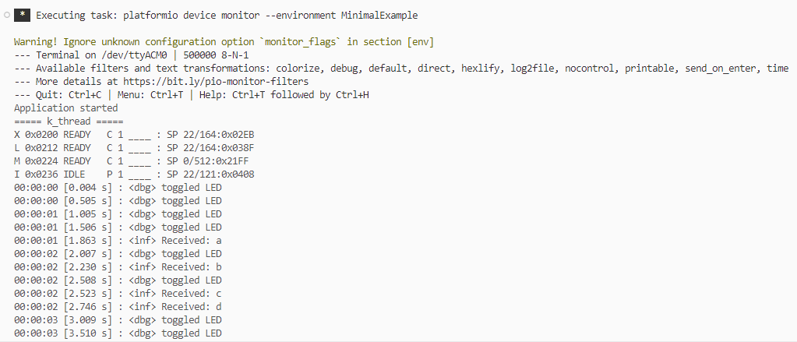
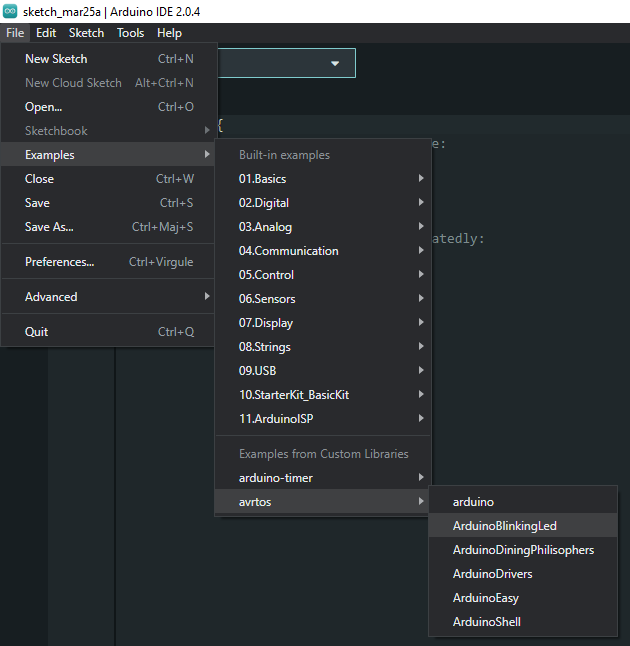
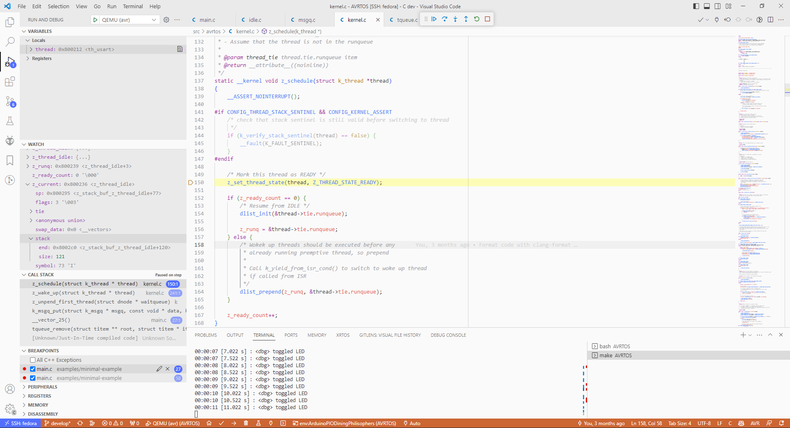

# AVRTOS: An RTOS for 8-bit AVR Microcontrollers

### Description

Example [minimal-example](examples/minimal-example/main.c) configures an usart, 
and blink a led at a frequency of 1Hz.
Morover, typing a character on the serial console will wake up a thread which
will print the received character.

### Code

Configuration:

```
CONFIG_KERNEL_COOPERATIVE_THREADS=1
CONFIG_KERNEL_TIME_SLICE_US=1000
CONFIG_INTERRUPT_POLICY=1
CONFIG_KERNEL_THREAD_TERMINATION_TYPE=-1
CONFIG_THREAD_MAIN_COOPERATIVE=1
CONFIG_STDIO_PRINTF_TO_USART=0
CONFIG_KERNEL_UPTIME=1
```

Code:
```c
/*
 * Copyright (c) 2022 Lucas Dietrich <ld.adecy@gmail.com>
 *
 * SPDX-License-Identifier: Apache-2.0
 */

#include <avrtos/avrtos.h>
#include <avrtos/debug.h>
#include <avrtos/drivers/gpio.h>
#include <avrtos/drivers/usart.h>
#include <avrtos/logging.h>
#include <avrtos/misc/led.h>
#define LOG_LEVEL LOG_LEVEL_DBG

K_MSGQ_DEFINE(usart_msgq, 1u, 16u);

static void thread_usart(void *arg);
static void thread_led(void *arg);

K_THREAD_DEFINE(th_usart, thread_usart, 164u, K_COOPERATIVE, NULL, 'X');
K_THREAD_DEFINE(th_led, thread_led, 164u, K_COOPERATIVE, NULL, 'L');

ISR(USART0_RX_vect)
{
	const char c = USART0_DEVICE->UDRn;

	k_msgq_put(&usart_msgq, &c, K_NO_WAIT);
}

int main(void)
{
	const struct usart_config usart_config = {
		.baudrate    = USART_BAUD_500000,
		.receiver    = 1u,
		.transmitter = 1u,
		.mode	     = USART_MODE_ASYNCHRONOUS,
		.parity	     = USART_PARITY_NONE,
		.stopbits    = USART_STOP_BITS_1,
		.databits    = USART_DATA_BITS_8,
		.speed_mode  = USART_SPEED_MODE_NORMAL,
	};
	ll_usart_init(USART0_DEVICE, &usart_config);
	ll_usart_enable_rx_isr(USART0_DEVICE);

	led_init();

	LOG_INF("Application started");

	k_thread_dump_all();

	k_stop();
}

static void thread_usart(void *arg)
{
	char c;
	for (;;) {
		if (k_msgq_get(&usart_msgq, &c, K_FOREVER) >= 0) {
			k_show_uptime();
			LOG_INF("<inf> Received: %c", c);
		}
	}
}

static void thread_led(void *arg)
{
	for (;;) {
		k_show_uptime();
		led_toggle();
		LOG_DBG("<dbg> toggled LED");
		k_sleep(K_MSEC(500u));
	}
}
```

Build and flash using PlatformIO. Expected output on the serial console: 



## Configuration

AVRTOS is highly configurable, file [src/avrtos/avrtos_conf.h](./src/avrtos/avrtos_conf.h) lists all the default configuration options.

For arduino framework, a dedicated configuration file is provided in [src/avrtos/avrtos_conf_arduino.h](./src/avrtos/avrtos_arduinoide_conf.h).

## Build

Several build systems are supported:
- Cmake
- Arduino IDE
- PlatformIO (with and without Arduino Framework)

### Arduino IDE

Install the Arduino IDE (1 or 2) from [arduino.cc](https://www.arduino.cc/en/software).

Copy complete `AVRTOS` folder to your Arduino libraries folder.

Open the Arduino IDE and select your board/port.

Select the sample :



Build and upload the sample.

### PlatformIO

### Build, flash and monitor samples

PlatformIO extension for VSCode is recommended (`platformio.platformio-ide`).
Simply select your sample and build it.

### Use AVRTOS as a library dependency in your project

You can clone this repository in your project's `lib` folder, a typical `platformio.ini` file would look like this:

```ini
[env]
platform = atmelavr
board = pro16MHzatmega328
; board = megaatmega2560

upload_port = COM3
monitor_port = COM3
monitor_speed = 500000

build_src_filter = 
	+<AVRTOS/src/>

build_flags = 
    -Wl,-T./avrtos-avr5.xn
    ; -Wl,-T./avrtos-avr6.xn

	-DCONFIG_THREAD_MAIN_STACK_SIZE=256
	-DCONFIG_THREAD_EXPLICIT_MAIN_STACK=0
	-DCONFIG_THREAD_MAIN_COOPERATIVE=1
    	-DCONFIG_KERNEL_SYSCLOCK_PERIOD_US=1000
    	-DCONFIG_KERNEL_TIME_SLICE_US=1000
	; other options ...
```

An example project which uses AVRTOS as a dependency can be found here: [github.com/lucasdietrich/caniot-device](https://github.com/lucasdietrich/caniot-device)

### Cmake

To build the samples with cmake, you'll need to have `avr-gcc`, `avr-gcc-c++`, 
`avr-libc`, `avr-binutils`, `cmake`, `make`, `ninja-build` installed,
`avr-gdb`, `avrdude` and `qemu-system-avr` are optional

To configure your environnement for an Arduino Mega 2560, run the following commands:

```bash
cmake -S . -B build \
  -DCMAKE_TOOLCHAIN_FILE="cmake/avr6-atmega2560.cmake"
```

You can also specify the generator :

```bash
cmake -S . -B build \
  -DCMAKE_TOOLCHAIN_FILE="cmake/avr6-atmega2560.cmake" \
  -DCMAKE_GENERATOR="Unix Makefiles"
```

You can also provide the device where the program will be flashed, this enables 
make commands like `make upload_sample_program`:
```bash
cmake -S . -B build \
  -DCMAKE_TOOLCHAIN_FILE="cmake/avr6-atmega2560.cmake" \
  -DPROG_DEV=/dev/ttyACM0
```

To build the `minimal_example` program, run the following command (Replace `ninja`
with `make` if you specified the `Unix Makefiles` generator) :

```bash
make -C build sample_minimal_example
```

To flash the binary to your device, run the following command:

```bash
make -C build upload_sample_minimal_example
```

Monitor the serial console with `miniterm`:
```bash
BAUDRATE=500000 make monitor
```

### Custom target (Cmake)

In case you have a custom target (e.g. a board not explicitly supported by AVRTOS), 
you can create a custom `avr<version>-<target>.cmake` file and specify it with the `CMAKE_TOOLCHAIN_FILE` option.

A toolchain file has the following structure:

```cmake
set(F_CPU 16000000UL)
set(MCU atmega328p)
set(LINKER_SCRIPT ${CMAKE_CURRENT_LIST_DIR}/../architecture/avr/avrtos-avr5-atmega328p.xn)
set(QEMU_MCU uno)
set(PROG_TYPE wiring) # arduino
set(PROG_PARTNO m328p)

include(${CMAKE_CURRENT_LIST_DIR}/avr.cmake)
```

| Option                        | Description                                                                                                                              |
| ----------------------------- | ---------------------------------------------------------------------------------------------------------------------------------------- |
| `F_CPU`                       | Defines the CPU clock frequency.                                                                                               |
| `MCU`                         | Specifies the target microcontroller unit (MCU) as ATmega328P. See list https://www.nongnu.org/avr-libc/user-manual/using_tools.html     |
| `LINKER_SCRIPT`               | Sets the linker script path for the project. Linker scripts location: [architecture/avr](./architecture/avr)                             |
| `QEMU_MCU` (QEMU only)        | Specifies the target microcontroller unit (MCU) for QEMU simulation as "uno." Can be listed with command `qemu-system-avr -machine help` |
| `PROG_TYPE` (real board only) | Sets the programming type to "wiring." Can be listed with command `avrdude -c help`                                                      |
| `PROG_PARTNO m328p`           | Specifies the target microcontroller part number as "m328p." Can be listed with command `avrdude -c ${PROG_TYPE} -p help`                |
| `FEATURE_TIMER_COUNT`         | Sets the number of 16-bit timers available on the target.                                                              |
| `FEATURE_UART_COUNT`          | Sets the number of UARTs available on the target.                                                                 |
| `include(...)`                | Includes the AVR architecture generic cmake file                                                                                         |

### Custom target (PlatformIO)

In order to describe a custom target with PlatformIO, please refer to the
example `platformio.ini` file from section [Use AVRTOS as a library dependency in your project](#use-avrtos-as-a-library-dependency-in-your-project).


### Run/debug in QEMU

Note about AVR support in QEMU: https://qemu-project.gitlab.io/qemu/system/target-avr.html
You will have limited support for peripherals: all UART are supported, however 
only 16-bit timers are supported.

Moreover you'll need to apply the following patch to QEMU (<= 8.0.2): 
[scripts/patches/0001-Fix-handling-of-AVR-interrupts-above-33-by-switching.patch](./scripts/patches/0001-Fix-handling-of-AVR-interrupts-above-33-by-switching.patch)
to have all 16-bit timers working.

In case you want to emulate you program with QEMU:
```bash
cmake -S . -B build \
  -DCMAKE_TOOLCHAIN_FILE="cmake/avr6-atmega2560.cmake" \
  -DCMAKE_BUILD_TYPE=Debug \
  -DQEMU=ON
```

This enables targets like `run_sample_*` and `qemu_sample_*`.
For example, to run the `minimal-example` program in QEMU, run the following command:

```bash
ninja -C build run_sample_minimal_example
```

To exit QEMU, press `Ctrl+A` and then `x`.

If you want to debug your program with QEMU, run the following command:

```bash
ninja -C build qemu_sample_minimal_example
```

With VS Code, select `QEMU (avr)` configuration, then press `F5` to start debugging (`launch.json` configuration is automatically generated during build).



### Use Makefile

The `Makefile` at the root of the project provides *shortcut* commands to build 
and flash samples.

### Build a sample for QEMU

In order to build the sample `shell` for QEMU run:

	QEMU=ON SAMPLE=shell make

Run it with:

	make run_qemu

Debug it with:

	make qemu

### Build a sample for a custom target

In order to build the sample `drv-timer` for a custom target run:

	TOOLCHAIN_FILE="cmake/avr5-board-caniot-tiny-pb.cmake" SAMPLE="drv-timer" make single

Upload it with:

	make upload

Monitor it with:

	make monitor

### Build in Docker container

Two `Dockerfile` are provided to build the project in a container (based on Fedora)
- [scripts/Dockerfile-base](./scripts/Dockerfile-base) is used as a base image for Jenkins (Devops)
- ~~[scripts/Dockerfile-run](./scripts/Dockerfile-run) is used to build the project directly~~ (deprecated)

Build the container with:

    docker build -t fedora-avr-toolchain -f scripts/Dockerfile-base .

Run the container with (`Z` flag is required with SELinux)

    docker run -it --rm -v $(pwd):/avrtos:Z fedora-avr-toolchain

Build the project within it:

    cd /avrtos
    cmake -S . -B build \
    	-DCMAKE_TOOLCHAIN_FILE="cmake/avr6-atmega2560.cmake" \
	-DCMAKE_BUILD_TYPE=Debug \
	-DQEMU=ON \
	-G="Ninja"
    ninja -C build sample_minimal_example

Run the sample in QEMU:

    ninja -C build run_sample_minimal_example

### Jenkins

A [Jenkinsfile](./Jenkinsfile) is provided to build the project in a Jenkins (multibranch) pipeline.

It is based on the previous Docker container: `devops/fedora-avr-toolchain`